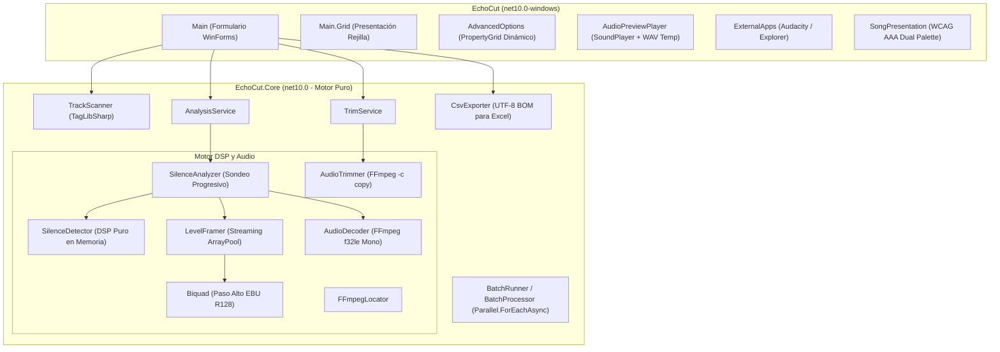

# EchoCut

<p align="center">
  <strong>El recortador inteligente y sin pérdidas de silencio final para bibliotecas de audio masivas.</strong>
</p>

<p align="center">
  
  
  
  
  
  
  
</p>

---

## 🎯 ¿Qué es EchoCut?

**EchoCut** es una aplicación de escritorio para Windows y un motor de procesamiento digital de señales (DSP) de alto rendimiento construido sobre **.NET 10** y **C# 14**. Su propósito es analizar carpetas enteras de música y audiolibros, detectar con precisión quirúrgica el silencio innecesario, colas muertas o ruido residual al final de cada archivo, y recortarlos por lote **sin recodificar el audio y sin tocar los archivos originales**.

Si eres DJ, coleccionista musical, archivista, podcaster o simplemente te desespera el "tiempo muerto" entre canciones en tu auto o reproductor portátil, EchoCut automatiza la limpieza de miles de pistas en minutos, conservando una fidelidad sonora absoluta.

---

## 💡 La Diferencia EchoCut: Ingeniería Acústica Real

La mayoría de los programas de recorte cometen uno de dos errores fatales: usan una compuerta de volumen (*gate*) ingenua que corta abruptamente las canciones que terminan en desvanecimiento (*fade-out*), o recodifican todo a MP3 perdiendo calidad acústica en cada pasada (pérdida generacional).

EchoCut fue diseñado bajo principios estrictos de ingeniería acústica:

1. **Cero Pérdida Generacional (`-c copy`)**:
   El recorte se realiza mediante copia de flujo directo con FFmpeg. **No hay recodificación**. Un archivo MP3 de 320 Kbps sigue siendo exactamente el mismo flujo comprimido; los metadatos ID3v2, portadas y etiquetas se conservan intactos y cada archivo se procesa en una fracción de segundo.
2. **Procesamiento 100% No Destructivo**:
   Los archivos originales **nunca se sobrescriben**. Las copias recortadas se guardan de forma aislada en la subcarpeta `Recortados/`.
3. **Filtro Paso Alto RLB (EBU R128)**:
   Antes de medir energía, la señal pasa por un filtro digital Biquad paso alto de 2.° orden calibrado a ~38.14 Hz (portado del código matemático de Audacity). Esto elimina el *offset* de corriente directa (DC) y el retumbe subsónico de digitalizaciones de vinilo que engañan a las compuertas convencionales.
4. **Disparador Schmitt e Histéresis Dinámica**:
   No utiliza un solo umbral. Emplea una banda de histéresis: el contenido musical se confirma con un umbral alto y la entrada a silencio se declara con un umbral bajo. La zona intermedia (reverberación de sala, colas de platillos) se preserva íntegramente.
5. **Detección Automática de Fundidos (*Fade-Outs*) por Regresión Lineal**:
   Calcula la pendiente de energía y la bondad de ajuste ($R^2$) mediante mínimos cuadrados en escala logarítmica. Si detecta un desvanecimiento musical regular, añade un margen de guarda adicional (`FadeGuardSeconds`) para que el tema termine con naturalidad.
6. **Afinación de Corte en Frontera Silenciosa (`RefineCut`)**:
   Para evitar el clásico "clic" o "pop" digital al truncar la forma de onda, el algoritmo busca y retrasa el punto de corte hasta la frontera de trama de menor nivel acústico dentro de una ventana de tolerancia.
7. **Piso de Ruido Adaptativo (*Hiss Protection*)**:
   El umbral no es estático; se adapta al piso de ruido de la grabación. Una pista grabada de cinta con *hiss* a -44 dBFS no se queda sin recortar ni se corta a la mitad: el algoritmo identifica el piso real y sitúa el umbral por encima con margen seguro.
8. **Protección de Másters Silenciosos**:
   El umbral nunca se acerca al nivel de programa (el pasaje más sonoro medido en RMS) a menos de una distancia configurable, protegiendo obras de música clásica o grabaciones acústicas con amplio rango dinámico.

---

## 🏗️ Arquitectura de la Solución

EchoCut sigue una estricta separación de responsabilidades:



### Pureza de Dominio en `EchoCut.Core`
* **Compilación Limpia**: `EchoCut.Core` compila para `net10.0` estándar (sin `-windows`). No contiene referencias a WinForms, GDI+ ni APIs de interfaz gráfica.
* **Memoria Cero en el LOH**: El decodificador no carga el audio completo en RAM. El flujo de muestras PCM se procesa en bloques mediante `ISampleSink` y `LevelFramer`, reutilizando búferes con `ArrayPool<byte>` y `ArrayPool<double>`.
* **Sondeo Progresivo**: En lugar de decodificar canciones de 10 minutos completas, analiza inicialmente los últimos 30 segundos (`InitialWindowSeconds`). Solo si toda la ventana es silencio, cuadruplica el tamaño progresivamente.

---

## 🔄 Flujo del Algoritmo DSP


---

## 🎛️ Parámetros del Algoritmo

EchoCut incluye 21 parámetros calibrados exhaustivamente para música comercial masterizada. Puedes ajustarlos desde el diálogo **Avanzado**:

| Categoría | Parámetro | Por Defecto | Descripción |
| :--- | :--- | :---: | :--- |
| **1 · Umbral** | `Umbral base (dBFS)` | `-50.0 dBFS` | Nivel por debajo del cual una trama se considera silencio antes de adaptar al ruido. |
| | `Histéresis (dB)` | `6.0 dB` | Separación del disparador de Schmitt. La banda intermedia protege reverberaciones ambiguas. |
| | `Margen sobre el ruido (dB)` | `6.0 dB` | Elevación del umbral sobre el ruido de fondo medido para evitar fallos con *tape hiss*. |
| | `Umbral máximo (dBFS)` | `-35.0 dBFS` | Techo absoluto para que el piso adaptativo nunca corte música real. |
| | `Margen bajo nivel programa (dB)` | `20.0 dB` | Distancia mínima al pasaje más sonoro. Protege másters silenciosos. |
| | `Umbral mínimo (dBFS)` | `-90.0 dBFS` | Suelo absoluto para que pistas muy tenues no anulen el silencio digital. |
| **2 · Medición** | `Trama de análisis (ms)` | `20.0 ms` | Resolución temporal de cada bloque de energía RMS. |
| | `Paso alto previo (Hz)` | `38.14 Hz` | Filtro Biquad RLB (EBU R128). Descarta DC y subgraves inaudibles. |
| | `Sondeo de nivel (s)` | `0.5 s` | Duración del tramo más silencioso y más sonoro para calcular estadísticas. |
| | `Confirmación de contenido (ms)` | `150.0 ms` | Ventana donde al menos el 50% de tramas deben superar el umbral para no cortar por un clic. |
| **3 · Decisión** | `Silencio mínimo (s)` | `2.0 s` | Duración mínima de silencio final requerida para justificar un corte. |
| | `Profundidad exigida (dB)` | `12.0 dB` | Caída necesaria bajo el umbral para distinguir silencio de reverberación activa. |
| | `Sondeo de profundidad (s)` | `0.5 s` | Tramo final donde se mide la mediana de profundidad. |
| | `Caída máxima silencio (dB/s)` | `-2.0 dB/s` | Pendiente máxima para aceptar colas de hiss planas que no se hunden. |
| | `Ahorro mínimo (s)` | `0.5 s` | Ganancia de tiempo mínima necesaria para escribir un archivo nuevo. |
| **4 · Fundido** | `Tramo de análisis (s)` | `2.0 s` | Ventana previa al corte donde se evalúa la pendiente de desvanecimiento. |
| | `Pendiente de fundido (dB/s)` | `-6.0 dB/s` | Pendiente por debajo de la cual el decaimiento se clasifica como fundido. |
| | `Regularidad exigida (R²)` | `0.50` | Coeficiente de determinación lineal para descartar finales abruptos e irregulares. |
| | `Guarda de fundido (s)` | `0.5 s` | Margen adicional que se suma a la tolerancia si hay fundido confirmado. |
| **5 · Corte** | `Tolerancia (s)` | `0.3 s` | Silencio remanente conservado tras el corte (configurable en la pantalla principal). |
| | `Búsqueda del corte (s)` | `0.2 s` | Ventana de desplazamiento hacia la frontera de trama más silenciosa (anti-clic). |

---

## 🎵 Formatos de Audio Compatibles

Gracias a la integración combinada de **TagLibSharp** (lectura de metadatos) y **FFmpeg** (decodificación y copia de flujo), EchoCut soporta 19 extensiones:

| Formato | Extensiones | Corte sin pérdida (`-c copy`) |
| :--- | :--- | :---: |
| **MPEG Audio** | `.mp3` | ✅ |
| **Free Lossless Audio Codec** | `.flac` | ✅ |
| **Waveform Audio** | `.wav` | ✅ |
| **Advanced Audio Coding** | `.aac`, `.m4a`, `.m4b`, `.m4p` | ✅ |
| **Ogg Vorbis / Audio** | `.ogg`, `.oga` | ✅ |
| **Windows Media Audio** | `.wma` | ✅ |
| **Audio Interchange (Apple)** | `.aiff` | ✅ |
| **Monkey's Audio** | `.ape` | ✅ |
| **WavPack** | `.wv` | ✅ |
| **Musepack** | `.mpc`, `.mpp` | ✅ |
| **Direct Stream Digital** | `.dsf` | ✅ |
| **WebM / Opus** | `.webm` | ✅ |
| **Audible Audiobooks** | `.aa`, `.aax` | ✅ |

---

## ♿ Accesibilidad de Primer Nivel (WCAG 2.1 AAA)

EchoCut fue diseñado pensando en una experiencia visual inclusiva:
* **Paleta Dual de Alto Contraste**: Los textos coloreados mantienen un ratio superior a **7:1 (AAA)** sobre fondo blanco y conmutan automáticamente a una paleta luminosa complementaria cuando la fila se selecciona sobre el fondo azul medianoche (`#17426c`), alcanzando ratios de hasta **17:1**.
* **Diseño para Daltonismo**: La diferenciación cromática de estados toma en cuenta protanopía y deuteranopía.
* **Redundancia Semántica (Criterio 1.4.1 WCAG)**: El color jamás es el único indicio. Cada fila cuenta con la columna textual de estado y glifos explícitos (`▶` reproducir, `⏹` detener, `✂` recortar, `✔` completado, `·` inactivo).

---

## 🚀 Instalación y Puesta en Marcha

### Requisitos Previos
1. **Sistema Operativo**: Windows 10 o Windows 11 (64 bits).
2. **.NET 10 Desktop Runtime**: Necesario para ejecutar la aplicación ([Descargar .NET 10](https://dotnet.microsoft.com/download/dotnet/10.0)). Si compilas el código, requerirás el **.NET 10 SDK**.
3. **FFmpeg y FFprobe**:
   - Se recomienda tener `ffmpeg.exe` y `ffprobe.exe` agregados a la variable de entorno `PATH` de Windows.
   - Si no están en el `PATH`, EchoCut te solicitará su ubicación la primera vez mediante un explorador de carpetas y guardará la ruta en `%APPDATA%\EchoCut\settings.json`.

### Compilación desde el Código Fuente

Clona el repositorio y compila la solución con el CLI de .NET:

```powershell
# 1. Clonar el repositorio
git clone https://github.com/tu-usuario/EchoCut.git
cd EchoCut

# 2. Restaurar dependencias y paquetes NuGet
dotnet restore EchoCut.slnx

# 3. Compilar en modo Release
dotnet build EchoCut.slnx -c Release

# 4. Ejecutar la aplicación
dotnet run --project EchoCut/EchoCut.csproj -c Release
```

---

## 📖 Guía de Uso Paso a Paso

1. **Seleccionar Carpeta (`Ruta...`)**: Elige el directorio que contiene tus pistas de audio. EchoCut listará los archivos y leerá sus etiquetas en segundo plano.
2. **Ajustar Tolerancia e Hilos**:
   - **Tolerancia**: Los segundos de silencio que deseas conservar al final (0.3 s por defecto es el estándar musical ideal).
   - **Hilos**: Grado de paralelismo (EchoCut calibra automáticamente entre 1 y 8 hilos según tu procesador).
3. **Analizar (`Analizar`)**: EchoCut procesará las colas de las canciones en paralelo, mostrando el progreso y coloreando las filas recortables en ámbar oscuro.
4. **Previsualizar de Oído (`▶`)**: Pulsa el botón de reproducción en cualquier fila. Sonarán de inmediato los últimos 3 segundos musicales más la tolerancia configurada, permitiéndote comprobar auditivamente que el corte no se come la canción.
5. **Recortar**:
   - Pulsa **`Recortar todo`** para procesar en lote todas las pistas válidas.
   - O pulsa la tijera **`✂`** en una fila específica para recortar únicamente esa canción.
   - Las copias resultantes se crearán en la subcarpeta `Recortados/`.
6. **Auditoría e Inspección**:
   - **Clic derecho sobre una fila**: Selecciona *Abrir ubicación* para ver el archivo en el Explorador de Windows, o *Abrir en Audacity* para inspeccionar visualmente su forma de onda.
   - **Exportar (`Exportar`)**: Genera un archivo CSV codificado en UTF-8 con BOM y separador regional, listo para abrirse en Microsoft Excel con todas las métricas acústicas de cada pista.

---

## 🤝 Contribución y Comunidad

¡Las contribuciones son bienvenidas! Consulta nuestra [Guía de Contribución](CONTRIBUTING.md) para conocer nuestros estándares de código limpio en C# 14 / .NET 10 y el flujo de trabajo con Git.

Por favor, revisa también nuestro [Código de Conducta](CODE_OF_CONDUCT.md) para mantener un entorno respetuoso y colaborativo.

Para conocer el historial de versiones y cambios detallados, consulta el [CHANGELOG.md](CHANGELOG.md).

---

## 📄 Licencia

Este proyecto está distribuido bajo la licencia **GNU General Public License v3.0 (GPLv3)**. Consulta el archivo [LICENSE.txt](LICENSE.txt) para más detalles.