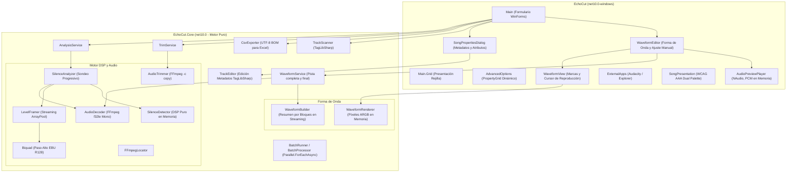
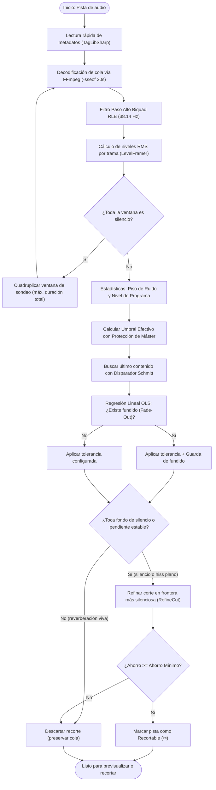

# EchoCut

<p align="center">
  <strong>El recortador inteligente y sin pérdidas de silencio inicial y final para bibliotecas de audio masivas.</strong>
</p>

<p align="center">
  
  
  
  
  
  
  
  
</p>

---

## 🎯 ¿Qué es EchoCut?

**EchoCut** es una aplicación de escritorio para Windows y un motor de procesamiento digital de señales (DSP) de alto rendimiento construido sobre **.NET 10** y **C# 14**. Su propósito es analizar carpetas enteras de música y audiolibros, detectar con precisión quirúrgica el silencio innecesario, entradas y colas muertas o ruido residual al inicio y al final de cada archivo, y recortarlos por lote **sin recodificar el audio y sin tocar los archivos originales**.

Si eres DJ, coleccionista musical, archivista, podcaster o simplemente te desespera el "tiempo muerto" entre canciones en tu auto o reproductor portátil, EchoCut automatiza la limpieza de miles de pistas en minutos, conservando una fidelidad sonora absoluta.

---

## 💡 La Diferencia EchoCut: Ingeniería Acústica Real

La mayoría de los programas de recorte cometen uno de dos errores fatales: usan una compuerta de volumen (*gate*) ingenua que corta abruptamente las canciones que terminan en desvanecimiento (*fade-out*), o recodifican todo a MP3 perdiendo calidad acústica en cada pasada (pérdida generacional).

EchoCut fue diseñado bajo principios estrictos de ingeniería acústica:

1. **Cero Pérdida Generacional (`-c copy`)**:
   El recorte se realiza mediante copia de flujo directo con FFmpeg. **No hay recodificación**. Un archivo MP3 de 320 Kbps sigue siendo exactamente el mismo flujo comprimido; los metadatos ID3v2, portadas y etiquetas se conservan intactos y cada archivo se procesa en una fracción de segundo.
2. **Recorte 100% No Destructivo**:
   El recorte **nunca sobrescribe** los archivos originales: las copias recortadas se guardan de forma aislada en la subcarpeta `Recortados/`. Las únicas operaciones que modifican los originales —editar propiedades, limpiar o normalizar metadatos y eliminar archivos— son explícitas y piden confirmación.
3. **Filtro Paso Alto RLB (EBU R128)**:
   Antes de medir energía, la señal pasa por un filtro digital Biquad paso alto de 2.° orden calibrado a ~38.14 Hz (portado del código matemático de Audacity). Esto elimina el *offset* de corriente directa (DC) y el retumbe subsónico de digitalizaciones de vinilo que engañan a las compuertas convencionales.
4. **Disparador Schmitt e Histéresis Dinámica**:
   No utiliza un solo umbral. Emplea una banda de histéresis: el contenido musical se confirma con un umbral alto y la entrada a silencio se declara con un umbral bajo. La zona intermedia (reverberación de sala, colas de platillos) se preserva íntegramente.
5. **Detección Automática de Fundidos (*Fade-Outs*) por Regresión Lineal**:
   Calcula la pendiente de energía y la bondad de ajuste ($R^2$) mediante mínimos cuadrados en escala logarítmica. Si detecta un desvanecimiento musical regular, añade un margen de guarda adicional (`FadeGuardSeconds`) para que el tema termine con naturalidad.
6. **Afinación de Corte en Frontera Silenciosa (`RefineCut`)**:
   Para evitar el clásico "clic" o "pop" digital al truncar la forma de onda, el algoritmo busca y retrasa el punto de corte hasta la frontera de trama de menor nivel acústico dentro de una ventana de tolerancia.
7. **Piso de Ruido Adaptativo (*Hiss Protection*)**:
   El umbral no es estático; se adapta al piso de ruido de la grabación. Una pista grabada de cinta con *hiss* a -44 dBFS no se queda sin recortar ni se corta a la mitad: el algoritmo identifica el piso real y sitúa el umbral por encima con margen seguro.
8. **Protección de Másters Silenciosos**:
   El umbral nunca se acerca al nivel de programa (el pasaje más sonoro medido en RMS) a menos de una distancia configurable, protegiendo obras de música clásica o grabaciones acústicas con amplio rango dinámico.
9. **Silencio Inicial por Análisis en Espejo**:
   El principio de la pista se analiza invirtiendo en el tiempo su curva de nivel y tratándola como una cola, de modo que el umbral adaptativo, la histéresis, la guarda de fundido (aquí, de entrada) y la afinación del corte se aplican idénticos en ambos bordes. Su mínimo es más corto que el del final para respetar las décimas de silencio deliberadas con que arrancan los másters comerciales.

---

## 🏗️ Arquitectura de la Solución

EchoCut sigue una estricta separación de responsabilidades:



### Pureza de Dominio en `EchoCut.Core`
* **Compilación Limpia**: `EchoCut.Core` compila para `net10.0` estándar (sin `-windows`). No contiene referencias a WinForms, GDI+ ni APIs de interfaz gráfica.
* **Memoria Cero en el LOH**: El decodificador no carga el audio completo en RAM. El flujo de muestras PCM se procesa en bloques mediante `ISampleSink` y `LevelFramer`, reutilizando búferes con `ArrayPool<byte>` y `ArrayPool<double>`.
* **Sondeo Progresivo**: En lugar de decodificar canciones de 10 minutos completas, analiza inicialmente los últimos 30 segundos (`InitialWindowSeconds`). Solo si toda la ventana es silencio, cuadruplica el tamaño progresivamente.
* **Forma de Onda sin Interfaz**: `WaveformBuilder` implementa `ISampleSink` y resume la señal mono mientras FFmpeg decodifica, guardando mínimo, máximo y energía por bloque de 256 muestras como los resúmenes de Audacity (3.7 MB para 30 minutos). `WaveformRenderer` pinta picos y banda RMS, en escala lineal o en dB, en un búfer ARGB en memoria que la interfaz solo envuelve en un `Bitmap`. El final de la pista se decodifica aparte y se sitúa con la misma referencia que el corte final.

---

## 🔄 Flujo del Algoritmo DSP



---

## 🎛️ Parámetros del Algoritmo

EchoCut incluye 24 parámetros calibrados exhaustivamente para música comercial masterizada. Puedes ajustarlos desde el diálogo **Avanzado**:

| Categoría | Parámetro | Por Defecto | Descripción |
| :--- | :--- | :---: | :--- |
| **1 · Umbral** | `Umbral base (dBFS)` | `-50.0 dBFS` | Nivel por debajo del cual una trama se considera silencio antes de adaptar al ruido. |
| | `Histéresis (dB)` | `6.0 dB` | Separación del disparador de Schmitt. La banda intermedia protege reverberaciones ambiguas. |
| | `Margen sobre el ruido (dB)` | `6.0 dB` | Elevación del umbral sobre el ruido de fondo medido para evitar fallos con *tape hiss*. |
| | `Umbral máximo (dBFS)` | `-35.0 dBFS` | Techo absoluto para que el piso adaptativo nunca corte música real. |
| | `Margen bajo nivel programa (dB)` | `20.0 dB` | Distancia mínima al pasaje más sonoro. Protege másters silenciosos. |
| | `Umbral mínimo (dBFS)` | `-90.0 dBFS` | Suelo absoluto para que pistas muy tenues no anulen el silencio digital. |
| **2 · Medición** | `Trama de análisis (ms)` | `20.0 ms` | Resolución temporal de cada bloque de energía RMS. |
| | `Paso alto previo (Hz)` | `38.14 Hz` | Filtro Biquad RLB (EBU R128). Descarta DC y subgraves inaudibles. |
| | `Sondeo de nivel (s)` | `0.5 s` | Duración del tramo más silencioso y más sonoro para calcular estadísticas. |
| | `Confirmación de contenido (ms)` | `150.0 ms` | Ventana donde al menos el 50% de tramas deben superar el umbral para no cortar por un clic. |
| **3 · Decisión** | `Silencio mínimo (s)` | `2.0 s` | Duración mínima de silencio final requerida para justificar un corte. |
| | `Profundidad exigida (dB)` | `12.0 dB` | Caída necesaria bajo el umbral para distinguir silencio de reverberación activa. |
| | `Sondeo de profundidad (s)` | `0.5 s` | Tramo final donde se mide la mediana de profundidad. |
| | `Caída máxima silencio (dB/s)` | `-2.0 dB/s` | Pendiente máxima para aceptar colas de hiss planas que no se hunden. |
| | `Ahorro mínimo (s)` | `0.5 s` | Ganancia de tiempo mínima necesaria para escribir un archivo nuevo. |
| **4 · Fundido** | `Tramo de análisis (s)` | `2.0 s` | Ventana previa al corte donde se evalúa la pendiente de desvanecimiento. |
| | `Pendiente de fundido (dB/s)` | `-6.0 dB/s` | Pendiente por debajo de la cual el decaimiento se clasifica como fundido. |
| | `Regularidad exigida (R²)` | `0.50` | Coeficiente de determinación lineal para descartar finales abruptos e irregulares. |
| | `Guarda de fundido (s)` | `0.5 s` | Margen adicional que se suma a la tolerancia si hay fundido confirmado. |
| **5 · Corte** | `Tolerancia (s)` | `0.3 s` | Silencio remanente conservado tras el corte (configurable en la pantalla principal). |
| | `Búsqueda del corte (s)` | `0.2 s` | Ventana de desplazamiento hacia la frontera de trama más silenciosa (anti-clic). |
| **6 · Previsualización** | `Tiempo de previsualización (s)` | `3.0 s` | Duración de la música previa al corte que se reproduce al pulsar el botón de previsualización para juzgar cómo quedará el final. |
| **7 · Inicio** | `Recortar silencio inicial` | `Sí` | Analiza también el principio de la pista y recorta su silencio conservando la tolerancia antes de la música. Desactivarlo ahorra la decodificación del inicio. |
| | `Silencio inicial mínimo (s)` | `1.0 s` | Silencio inicial mínimo para considerar recortable el principio. El resto de criterios se comparten con el final. |

---

## 🎵 Formatos de Audio Compatibles

Gracias a la integración combinada de **TagLibSharp** (lectura de metadatos) y **FFmpeg** (decodificación y copia de flujo), EchoCut soporta 19 extensiones:

| Formato | Extensiones | Corte sin pérdida (`-c copy`) |
| :--- | :--- | :---: |
| **MPEG Audio** | `.mp3` | ✅ |
| **Free Lossless Audio Codec** | `.flac` | ✅ |
| **Waveform Audio** | `.wav` | ✅ |
| **Advanced Audio Coding** | `.aac`, `.m4a`, `.m4b`, `.m4p` | ✅ |
| **Ogg Vorbis / Audio** | `.ogg`, `.oga` | ✅ |
| **Windows Media Audio** | `.wma` | ✅ |
| **Audio Interchange (Apple)** | `.aiff` | ✅ |
| **Monkey's Audio** | `.ape` | ✅ |
| **WavPack** | `.wv` | ✅ |
| **Musepack** | `.mpc`, `.mpp` | ✅ |
| **Direct Stream Digital** | `.dsf` | ✅ |
| **WebM / Opus** | `.webm` | ✅ |
| **Audible Audiobooks** | `.aa`, `.aax` | ✅ |

---

## ♿ Accesibilidad de Primer Nivel (WCAG 2.1 AAA)

EchoCut fue diseñado pensando en una experiencia visual inclusiva:
* **Paleta Dual de Alto Contraste**: Los textos coloreados mantienen un ratio superior a **7:1 (AAA)** sobre fondo blanco y conmutan automáticamente a una paleta luminosa complementaria cuando la fila se selecciona sobre el fondo azul medianoche (`#17426c`), alcanzando ratios de hasta **17:1**.
* **Diseño para Daltonismo**: La diferenciación cromática de estados toma en cuenta protanopía y deuteranopía.
* **Redundancia Semántica (Criterio 1.4.1 WCAG)**: El color jamás es el único indicio. Cada fila cuenta con la columna textual de estado y glifos explícitos (`▶` reproducir, `⏹` detener, `✂` recortar, `✔` completado, `·` inactivo).

---

## 🚀 Instalación y Puesta en Marcha

### Requisitos Previos
1. **Sistema Operativo**: Windows 10 o Windows 11 (64 bits).
2. **.NET 10 Desktop Runtime**: Necesario para ejecutar la aplicación ([Descargar .NET 10](https://dotnet.microsoft.com/download/dotnet/10.0)). Si compilas el código, requerirás el **.NET 10 SDK**.
3. **FFmpeg y FFprobe**:
   - Se recomienda tener `ffmpeg.exe` y `ffprobe.exe` agregados a la variable de entorno `PATH` de Windows.
   - Si no están en el `PATH`, EchoCut te solicitará su ubicación la primera vez mediante un explorador de carpetas y guardará la ruta en `%APPDATA%\EchoCut\settings.json`.

### Compilación desde el Código Fuente

Clona el repositorio y compila la solución con el CLI de .NET:

```powershell
# 1. Clonar el repositorio
git clone https://github.com/Dreizack97/EchoCut.git
cd EchoCut

# 2. Restaurar dependencias y paquetes NuGet
dotnet restore EchoCut.slnx

# 3. Compilar en modo Release
dotnet build EchoCut.slnx -c Release

# 4. Ejecutar la aplicación
dotnet run --project EchoCut/EchoCut.csproj -c Release
```

---

## 📖 Guía de Uso Paso a Paso

1. **Seleccionar Carpeta(s) o Archivo(s) (`Ruta...` / `Archivo(s)...`)**: Elige uno o varios directorios o selecciona archivos específicos directamente. EchoCut listará las pistas y leerá sus etiquetas y metadatos en segundo plano.
2. **Ajustar Tolerancia e Hilos**:
   - **Tolerancia**: Los segundos de silencio que deseas conservar al final (0.3 s por defecto es el estándar musical ideal).
   - **Hilos**: Grado de paralelismo (EchoCut calibra automáticamente entre 1 y 8 hilos según tu procesador).
3. **Analizar (`Analizar`)**: EchoCut procesará el principio y el final de las canciones en paralelo, mostrando el progreso y coloreando las filas recortables en ámbar oscuro.
4. **Previsualizar de Oído (`▶` / `⏹`)**: Pulsa el botón de reproducción en cualquier fila. Sonará de inmediato la música previa al punto de corte (3.0 s por defecto, personalizable en **Avanzado**) más la tolerancia conservada, permitiéndote comprobar auditivamente que el corte no interrumpe la frase musical.
5. **Recortar**:
   - Pulsa **`Recortar todo`** para procesar en lote todas las pistas válidas.
   - O pulsa la tijera **`✂`** en una fila específica para recortar únicamente esa canción.
   - Las copias resultantes se crearán en la subcarpeta `Recortados/` correspondiente a la carpeta de cada archivo.
6. **Auditoría, Edición de Metadatos y Gestión**:
   - **Clic derecho sobre una o varias filas**:
     - *Ver forma de onda y ajustar recorte*: Muestra la forma de onda de la pista completa y, en detalle, su principio y su final con el recorte superpuesto; lo que se eliminaría aparece con fondo gris y onda atenuada, como una selección de Audacity. La casilla *Escala en dB* agranda las colas de fundido y el hiss que en escala lineal parecen una línea plana. Arrastra las marcas con el ratón, muévelas con ← y → (10 ms; 100 ms con Mayús; 1 s con Ctrl) o escribe el instante exacto, y escucha cada borde tal como quedará mientras un cursor rojo recorre la forma de onda (el mismo botón lo detiene). El ajuste manual prevalece sobre el análisis durante la sesión, aunque cambies la tolerancia o vuelvas a analizar, y la fila pasa a estado *Ajustado*. También funciona con pistas sin analizar.
     - *Abrir ubicación*: Revela los archivos en el Explorador de Windows con las canciones seleccionadas.
     - *Abrir en Audacity*: Abre simultáneamente todas las pistas seleccionadas en una sesión de Audacity (o haz doble clic sobre cualquier fila para abrirla de inmediato).
     - *Editar propiedades*: Abre la ventana modal nativa de propiedades para consultar o editar metadatos ID3/Vorbis (título, artistas, año, álbum, etc.) o renombrar el archivo físico en disco.
     - *Renombrar* (`F2`): Edita el nombre del archivo directamente sobre la celda «Nombre», como en el Explorador; `Entrar` o pulsar fuera confirma y `Esc` descarta. Si el nombre no es válido o ya existe, se avisa y se reabre la edición para corregirlo.
     - *Eliminar archivo(s)*: Elimina permanentemente los archivos seleccionados del disco tras confirmar la operación (también disponible pulsando la tecla **Suprimir** en la cuadrícula).
   - **Metadatos (`Utilidades › Metadatos`)**: Opera sobre las etiquetas de todas las pistas cargadas, tras confirmar la operación. Modifica los archivos originales.
     - *Eliminar metadatos*: Elimina todas las etiquetas (título, artistas, portada, etc.).
     - *Agregar metadatos…*: Aplica a todo el listado el artista, título, álbum, género y comentarios que se escriban, reemplazando los valores existentes; los campos en blanco no se modifican. El título puede tomarse del nombre del archivo de cada canción, y varios artistas o géneros se separan con «;». Solo se reescriben los archivos que realmente cambian.
   - **Normalizar (`Utilidades › Normalizar…`)**: Quita los acentos (conservando la «ñ») y pone en mayúscula la inicial de cada palabra en las propiedades que elijas de las pistas cargadas: nombre del archivo, título, subtítulo, intérpretes, artistas del álbum, álbum, géneros, compositores, comentario y derechos de autor. La selección se recuerda entre sesiones y la operación se confirma antes de empezar. Solo se reescriben las etiquetas elegidas y los archivos que realmente cambian; si se incluye el nombre del archivo, este se renombra en disco.
   - **Renombrar (`Utilidades › Renombrar`)**: Renombra en lote las canciones seleccionadas o, si hay una o ninguna seleccionada, todo el listado, en el orden de la rejilla. Una vista previa muestra cada nombre antes y después y no deja continuar si alguno no es válido, se repite o ya existe.
     - *Agregar consecutivo…*: Antepone un número con ceros a la izquierda, por ejemplo `0001 - Artista - Nombre.mp3`; se eligen el número inicial, los dígitos y el separador.
     - *Quitar caracteres iniciales…*: Elimina una cantidad de caracteres del principio del nombre y, opcionalmente, los espacios y separadores que queden delante.
   - **Exportar (`Exportar`)**: Genera un archivo CSV codificado en UTF-8 con BOM y separador regional, listo para abrirse en Microsoft Excel con todas las métricas acústicas de cada pista.
   - **Integrar con el Explorador de Windows (`Utilidades`)**: Agrega o quita «Abrir con EchoCut» en el menú contextual de los archivos de audio y las carpetas, sin permisos de administrador. En Windows 11 aparece en «Mostrar más opciones». Lo abierto desde el Explorador se suma al listado de la ventana ya abierta; si se mueve la carpeta de EchoCut, basta con volver a activar la opción.

---

## 🤝 Contribución y Comunidad

¡Las contribuciones son bienvenidas! Consulta nuestra [Guía de Contribución](CONTRIBUTING.md) para conocer nuestros estándares de código limpio en C# 14 / .NET 10 y el flujo de trabajo con Git.

Por favor, revisa también nuestro [Código de Conducta](CODE_OF_CONDUCT.md) para mantener un entorno respetuoso y colaborativo.

Para conocer el historial de versiones y cambios detallados, consulta el [CHANGELOG.md](CHANGELOG.md).

---

## 📄 Licencia

Este proyecto está distribuido bajo la licencia **GNU General Public License v3.0 (GPLv3)**. Consulta el archivo [LICENSE.txt](LICENSE.txt) para más detalles.